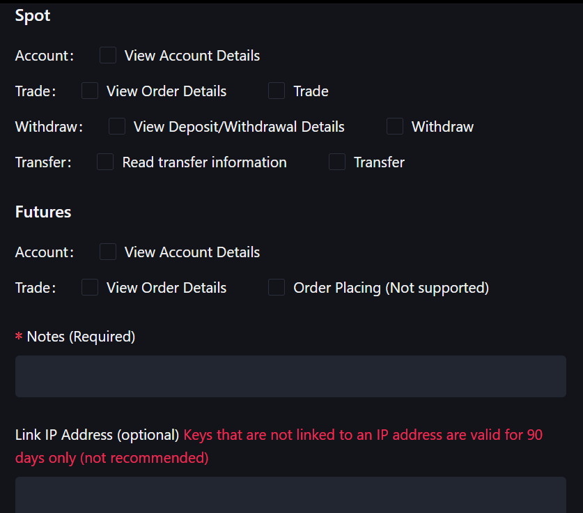
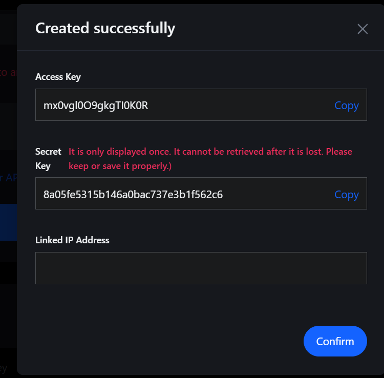

# API Key Setup

Here's a detailed guide on how to get your API keys from MEXC. If you already have them, feel free to skip to the [next section](/trading-examples).

## Step 1: Access the API Management Page

1. Go to [MEXC's API Management page](https://www.mexc.com/user/openapi)
2. Log in to your MEXC account if you haven't already
3. You'll be taken to the API key management page

## Step 2: Create a New API Key

You should see a dialog to select permissions for a new API key:

| 2) Select permissions | 3) Save API keys |
|---|---|
|||

> **Security Note**: Only enable the permissions you actually need. If you only need read-only access, don't enable trading permissions.

## Step 3: Save Your API Keys

After creating the API key, MEXC will display a dialog with your credentials:

**⚠️ Important**: This is the **only time** you'll see your secret key. Make sure to save it securely!

- **Access Key**: This is your public API key. 
- **Secret Key**: This is your private key - keep it secure!

## Step 4: Configure Your Environment

### Option A: Environment Variables (Recommended)

Create a `.env` file in your project root:

```bash
MEXC_ACCESS_KEY=your_access_key_here
MEXC_SECRET_KEY=your_secret_key_here
```

Then load it in your code:

```python
import os
from dotenv import load_dotenv
from mexc import MEXC

load_dotenv()

async with MEXC.env() as client:
  ...
```

### Option B: Direct Usage

```python
from mexc import MEXC

API_KEY = "your_access_key_here"
API_SECRET = "your_secret_key_here"

async with MEXC.new(API_KEY, API_SECRET) as client:
  ...
```

## Next Steps

Now that you have your API keys set up, you're ready to start trading! Check out:

- [Simple DCA Bot](/simple-dca-bot) - Start trading in MEXC with a simple DCA bot.
- [Hedging Perps](/hedging-perps) - Use real-time streams for automated hedging.