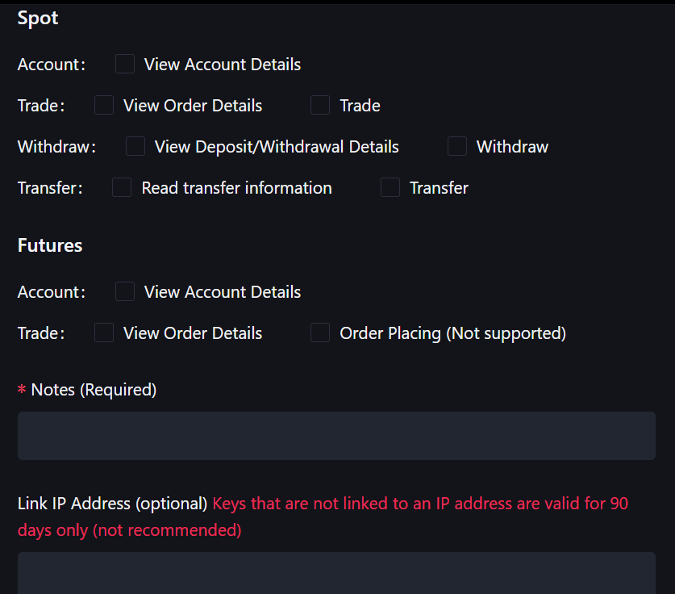
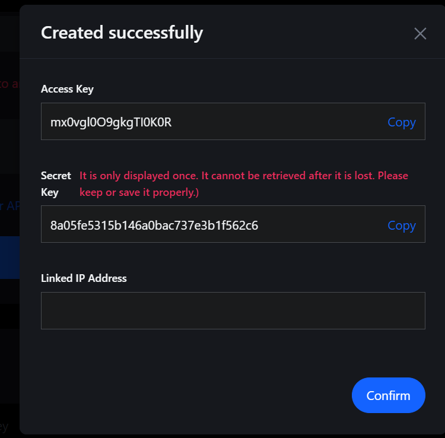

# Authentication

Set up your MEXC API credentials.

## Creating API Keys

### Step 1: Access the API Management Page

1. Go to [MEXC's API Management page](https://www.mexc.com/user/openapi)
2. Log in to your MEXC account if you haven't already
3. You'll be taken to the API key management page

### Step 2: Create a New API Key

You should see a dialog to select permissions for a new API key:

| 2) Select permissions | 3) Save API keys |
|---|---|
|||

> **Security Note**: Only enable the permissions you actually need. If you only need read-only access, don't enable trading permissions.

**IP whitelisting**: Keys that are not linked to an IP address are valid for 90 days only. Consider linking your key to your IP for better security and indefinite validity.

### Step 3: Save Your API Keys

After creating the API key, MEXC will display a dialog with your credentials:

**⚠️ Important**: This is the **only time** you'll see your secret key. Make sure to save it securely!

- **Access Key**: Your public API key
- **Secret Key**: Your private key — keep it secure!

**Note**: MEXC uses Access Key + Secret Key only (no passphrase unlike some other exchanges).

---

## Providing Credentials

### Method 1: Environment Variables (Recommended)

```bash
export MEXC_ACCESS_KEY="mx0vglxxxxxxxxxxxx"
export MEXC_SECRET_KEY="xxxxxxxxxxxxxxxxxxxxxxxxxxxxxxxx"
```

```python
from mexc import MEXC
async with MEXC.new() as client:
    account = await client.spot.account()
```

### Method 2: .env File

Create `.env` in your project root (add to `.gitignore`):

```bash
MEXC_ACCESS_KEY=your_access_key_here
MEXC_SECRET_KEY=your_secret_key_here
```

Then load it in your code:

```python
from dotenv import load_dotenv
load_dotenv()

from mexc import MEXC
async with MEXC.new() as client:
    account = await client.spot.account()
```

### Method 3: Explicit Parameters

```python
from mexc import MEXC

client = MEXC.new(
    api_key="your_access_key_here",
    api_secret="your_secret_key_here"
)
async with client:
    account = await client.spot.account()
```

## Testing Credentials

```python
async with MEXC.new() as client:
    await client.spot.account()  # Raises AuthError if invalid
```

## Troubleshooting

- **KeyError: 'MEXC_ACCESS_KEY'** — Set env vars or pass credentials explicitly.
- **Invalid signature** — Check secret key; sync system time if needed.
- **IP not whitelisted** — Add your IP in MEXC API settings or disable restriction.
- **Key expired** — Keys not linked to an IP expire after 90 days; create a new key or link to IP.

## Next Steps

- [Quickstart](quickstart.md) — Get up and running in 5 minutes
- [API Overview](api-overview.md) — Available endpoints
- [Examples](examples.md) — Common use cases and patterns
